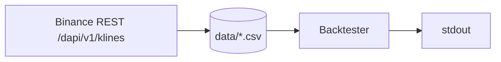

# Backtester

Replays historical Binance candles through a strategy and reports how it would have done.

```bash
go run ./cmd/backtester -days 365
```

```
     candles  105119  (2025-08-04 → 2026-08-04)
      trades    1927
    win rate   22.0%
      return  -90.0%
  buy & hold  -44.2%
      max DD  -90.3%
```

## Where the data comes from



**Not the websocket.** A WS stream only delivers candles going forward in time;
backtesting means replaying the past. The REST klines endpoint is free, needs no
auth, and paginates back to ~Aug 2020.

**Not a database.** A year of 5m candles is ~105k rows / 6.6 MB — it fits in a slice.
The cache is one CSV under `data/` (gitignored), extended at the tail on each run, so
only the first run of a range hits the network. A year takes ~19s cold, ~0.5s warm.
ClickHouse would only start to earn its keep at tick resolution across many symbols.

Kafka and ClickHouse in the top-level README are the *live* trading basePath. This
command touches neither.

## Flags

| Flag | Default | |
|---|---|---|
| `-symbol` | `BTCUSD_PERP` | coin-M futures symbol |
| `-interval` | `5m` | candle interval |
| `-days` | `365` | history to replay |
| `-fast` / `-slow` | `12` / `26` | EMA periods |
| `-fee` | `5` | taker fee per fill, basis points |
| `-cash` | `10000` | starting capital |
| `-cache` | `data` | cache directory |

## How a trade is simulated

Long/flat, all-in. A signal is produced by a **closed** candle and filled at the
**next candle's open** — the earliest price actually reachable. Filling on the signal
candle's own close would be lookahead bias and would flatter every result.

Fees matter more than they look. At 5 bps over 1927 trades the fee drag alone is what
turns a mildly losing strategy into a -90% one; compare `-fee 0` against `-fee 5` on
the same parameters before believing any edge.

> The default EMA cross loses badly on 5m bars. That is a real result, not a broken
> backtester — crossover systems on short intervals get eaten by costs.

## Not included

Shorts, position sizing, stop-losses, slippage, multi-symbol, parameter sweeps,
walk-forward validation. P&L is computed in USD terms; BTCUSD_PERP is an inverse
contract that really settles in BTC, which is fine for judging edge but understates
convexity (see the `ponytail:` note in `../../internal/report/backtest.go`).
