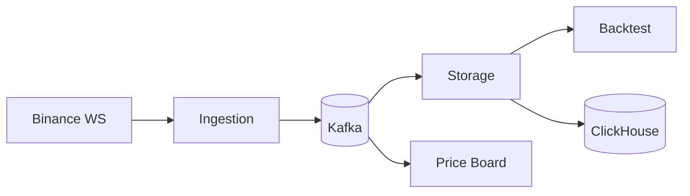

# Backtester 

Backtesting trading strategies with Binance data.

```mermaid
flowchart LR
    B[Binance WS] --> I[Ingestion]
    I --> K[(Kafka)]
    K --> S[Storage]
    K --> P[Price Board]
    S --> T[Backtest]
    S --> C[(ClickHouse)]
```